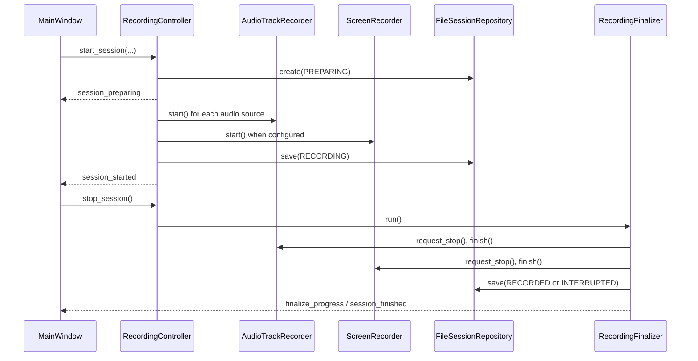
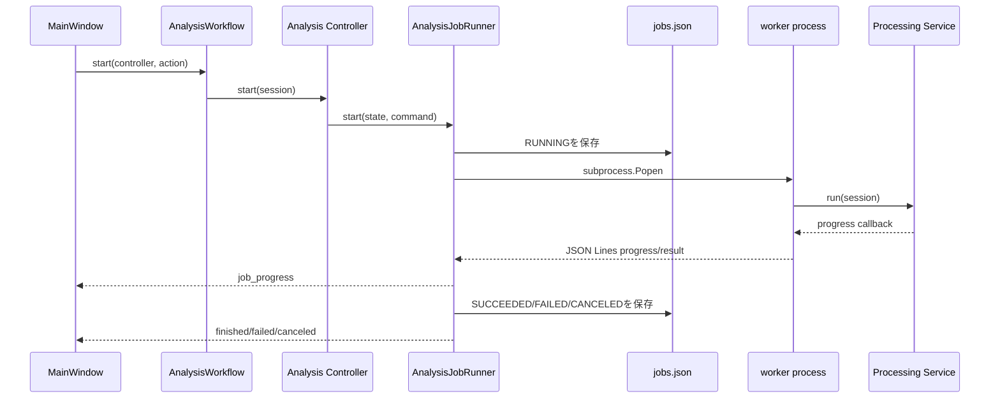

# アーキテクチャ

## 1. 全体構成

コードは、UI、application、domain、capture、processing、infrastructureの責務に分かれています。

```text
src/summarize_meeting/
├─ bootstrap.py          # 起動、依存構築、単一起動、ロギング、OS終了
├─ ui/                   # PySide6 Widgetと表示状態
├─ application/          # ユースケース調停、Controller、ジョブ・終了処理
├─ domain/               # セッション、ジョブ、音声・画面・発話の値モデル
├─ capture/              # 音声・画面デバイスの実装と録音
├─ processing/           # 録音後解析Service、Backend、worker CLI
├─ infrastructure/       # ファイル、設定、ログ、atomic I/O、保存先
└─ devtools/             # ベンチマーク、実音声スモーク、検証ツール
```

基本的な依存方向は`ui -> application -> domain`です。applicationとprocessingはinfrastructureを使ってファイルへ永続化します。ハードウェア固有処理はcapture、推論固有処理はprocessingへ閉じ込めています。

## 2. 起動と依存構築

`summarize_meeting:main`から`bootstrap.main()`へ入り、次の順序で起動します。

1. `PortableAppPaths.discover()`でアプリルートを決定。
2. 保存先の書き込み可否と単一起動ロックを確認。
3. `FileSettingsRepository`から設定を読み込む。
4. アプリログとPython・threading・Qtの例外/警告bridgeを構成。
5. `RecordingController`を構築。
6. 共有`FileAnalysisJobRepository`を4つの解析Controllerへ注入。
7. `MainWindow`と`RecoveryController`を構築し、Qt Signalを接続。
8. Qtイベントループを開始。

共有ジョブRepositoryを使うことで、文字起こし、話者分離、画面解析、会話要約が同じ`analysis/jobs.json`を更新しても、同一プロセス内のread-modify-writeが競合しません。

## 3. 録音フロー



`RecordingController`は入力列挙、プレビュー、開始・停止要求、Signal通知を調停します。終了時の順序制御、WAV統計、manifest、最終状態確定は`RecordingFinalizer`へ分離されています。

音声録音は開始gateで同期されます。選択した全音声ソースの初期化結果が揃うまで本記録を開始せず、少なくとも1ソースが利用可能なら録音を開始します。音声デバイス切断時は同じdevice IDへの再接続だけを試し、別デバイスへ自動切替しません。

## 4. 解析フロー

各解析Controllerは固有の前提条件とコマンド構築だけを担当し、プロセスライフサイクルを`AnalysisJobRunner`へ委譲します。



`AnalysisWorkflow`は複数解析の同時起動を防ぎ、UIのボタン可否を計算し、終了時に全Controllerをキャンセルして共通の期限内で待機します。

`AnalysisJobRunner`は以下を一元管理します。

- `RUNNING`と終端状態の保存
- workerプロセス起動
- stdout JSON Linesの進捗変換
- stderr相当の診断行保持
- キャンセルとプロセスツリー停止
- worker threadの待機
- 出力先がセッション配下にあることの検証

## 5. 解析ServiceとBackend

processing層は「データの検証・統合・保存」を行うServiceと、「外部ライブラリ・推論」を行うBackendに分かれます。

| Service | Backend | 役割 |
|---|---|---|
| `TranscriptionService` | `FasterWhisperBackend` | 音声trackごとの認識と共通時刻への統合 |
| `DiarizationService` | `SherpaOnnxDiarizationBackend` | PC音声の話者区間推定と発話への話者割当 |
| `ScreenAnalysisService` | `PaddleOcrBackend` | PNGごとのOCRと画面理解情報の生成 |
| `MinutesService` | `LlamaCppMinutesBackend` | timeline作成、分割要約、根拠検証、Markdown生成 |

BackendはProtocolで抽象化されているため、単体テストでは実モデルをロードせずfake backendを注入できます。

## 6. 永続化と整合性

### 単一ファイル

`write_json_atomic`、`write_text_atomic`、`write_bytes_atomic`は同一ディレクトリの一時ファイルへ書き込み、flushと`fsync`後に`os.replace`します。途中書きのファイルを正式名で公開しません。

### 複数成果物

文字起こし、話者分離、会話要約は複数ファイルで1つの成果物集合を構成します。`ArtifactPublisher`は全ファイルをstageした後に置換し、途中で失敗すると以前のファイルへロールバックします。公開先は指定ルート配下に制限されます。

### ジョブ状態

`FileAnalysisJobRepository`は解析種別ごとの状態を`jobs.json`に統合します。パス単位の共有lock、固有一時ファイル名、破損JSONの退避を行います。通常のI/O読込エラーは空データ扱いにせず呼び出し元へ返すため、既存状態を誤って上書きしません。

## 7. 復旧と終了

- `SessionRecoveryService`は`PREPARING`、`RECORDING`、`STOPPING`、`FINALIZING`のセッションを中断候補として検出します。
- 正常な最終WAVを優先し、必要な場合だけ`.work` segmentから`*.recovered.wav`を生成します。
- 正常にdecodeできるPNG tempを復旧します。
- 復旧後のセッション状態は`INTERRUPTED`です。
- 通常ウィンドウ終了時は解析をキャンセルして最大3秒待機します。
- OS終了要求時は解析を最大4秒、録音確定を最大4秒待機します。
- `RecordingFinalizer`は予期しない例外時もterminal eventを設定し、終了待機が永続的に残らないようにします。

## 8. ログ

アプリ全体ログは`data/logs/application.log`へ出力し、5 MiBでローテーションして3世代保持します。会議単位ログは`<session>/logs/session.log`へJSON Linesで保存します。

`SessionLogMonitor`は最初の書込障害を検出し、セッションwarning、アプリログ、UIへ通知します。以後の失敗を無言で捨て続けないためのapplication層境界です。

## 9. 変更時の設計ルール

- 新しい録音後解析を追加する場合は、Service/Backend/worker/Controllerを分け、共通RunnerとWorkflowへ接続する。
- Serviceはセッションschemaと前段成果物を実行前に検証する。
- 2ファイル以上を同時生成する場合は`ArtifactPublisher`を使う。
- セッション外の入力・出力パスを許可しない。
- UIから重い推論やデバイスI/Oを直接実行しない。
- 新しい永続フィールドにはschema互換性と障害時の復旧方針を定義する。
