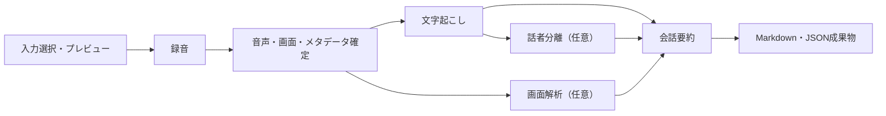

# プロジェクト概要

## 1. 目的

Summarize Meetingは、オンライン会議や一般的な会話をローカル中心で記録・解析するPythonデスクトップアプリです。マイク音声、PC再生音声、選択画面の重要な変化を共通の時刻軸で保存し、録音後に文字起こし、話者分離、画面OCR、根拠付き会話要約を実行します。

外部公開用のWebサーバーではありません。操作入口はPySide6製GUIと、解析用worker CLIです。録音音声と画面画像はローカルに保存されます。会話要約を有効にした場合だけ、文字起こしから作ったタイムラインを設定済みのOpenAI互換llama.cppサーバーへ送信します。

## 2. 主な機能

| 機能 | 内容 | 主な出力 |
|---|---|---|
| 入力検出・プレビュー | マイク、PC音声、画面を列挙し、録音前に入力レベルや画面を確認 | 保存なし |
| 録音 | マイクとPC音声を別WAVとして保存。重要な画面変化だけをPNG保存 | `audio/*.wav`, `screenshots/*.png` |
| 文字起こし | faster-whisperで各音声トラックを認識し、開始offsetで共通時刻へ統合 | `analysis/transcription.json`, `output/transcript.md` |
| 話者分離 | PC音声をsherpa-onnxで話者区間へ分離し、文字起こしへ話者を付与 | `analysis/diarization.json`, `analysis/diarized_transcription.json` |
| 話者名編集 | 推論をやり直さず、話者IDと表示名を更新してTranscriptを再生成 | `analysis/speaker_names.json`, `output/transcript.md` |
| 画面解析 | PaddleOCRで画面テキストを抽出し、画面種別・見出し・重要行を決定論的に整理 | `analysis/screens.json` |
| 会話要約 | 発話と画面をタイムライン化し、llama.cppで根拠ID付き要約を生成・検証 | `analysis/timeline.json`, `analysis/minutes.json`, `output/minutes.md` |
| 中断復旧 | 中断状態のセッションから検証可能なWAV segmentとPNG tempを復旧 | `*.recovered.wav`, 更新済み`session.json` |
| ログ | アプリ全体ログと会議単位の構造化ログを機密値を伏せて保存 | `data/logs/application.log`, `logs/session.log` |

## 3. 標準処理フロー

依存条件は次の通りです。

- 録音開始にはマイクまたはPC音声が最低1つ必要です。
- 文字起こしは`RECORDED`セッションとschema version 3の音声manifestを必要とします。
- 話者分離は成功済み文字起こしとPC音声トラックを必要とします。
- 画面解析は1件以上のスクリーンショットイベントを必要とします。
- 会話要約は成功済み文字起こしとLLMエンドポイント設定を必要とします。画面解析と話者分離は任意です。
- 録音後解析は同時に1種類だけ実行します。

## 4. 実行環境

- Python 3.11以上
- Windows 11
- Ubuntu 22.04 / WSL2 + WSLg
- UI言語: 日本語
- パッケージ管理: uv
- GUI: PySide6

主要な実行時依存はfaster-whisper、CTranslate2、sherpa-onnx、PaddleOCR、ONNX Runtime、SoundCard、sounddevice、PyAVです。バージョンの正本は`pyproject.toml`と`uv.lock`です。

## 5. プライバシーとネットワーク境界

- 音声録音、WAV処理、文字起こし、話者分離、画面OCRはローカルで実行します。
- faster-whisperモデルは初回準備時に取得される場合があります。
- 話者分離・OCRモデルは`scripts/setup_models.py`から取得します。
- 会話要約だけが設定したllama.cppサーバーへタイムライン情報を送ります。
- HTTPのLLM URLを指定すると通信は暗号化されません。必要に応じてHTTPSまたは信頼できる閉域網を使用してください。
- ログではアプリルート、会議名、セッションパス、デバイス名・IDをマスクします。

## 6. 信頼性上の方針

- JSONやテキストは一時ファイルへ書き、`fsync`後に`os.replace`で公開します。
- 同時に更新される複数成果物は`ArtifactPublisher`で全て準備し、途中失敗時は以前の世代へ戻します。
- `analysis/jobs.json`は解析種類ごとの最新状態を保持し、古い成功成果物より最新ジョブ状態を優先してUI表示します。
- 解析workerは別プロセスで実行し、キャンセル時はプロセスツリーを停止します。アプリ終了時は停止完了を期限付きで待ちます。
- スクリーンショットイベントの保存に失敗した場合、対応する孤立PNGを残しません。
- 録音の確定処理で一部が失敗した場合、可能な成果物を残してセッションを`INTERRUPTED`にします。

## 7. 現在の主な制約

- Waylandでは共有画面を永続的に列挙せず、Portalダイアログで取得ごとに選択します。
- ヘッドレス、SSHのみ、ロック画面、保護コンテンツは画面取得対象外です。
- OSのスリープ・休止状態をまたぐ録音は対象外です。
- LLMサーバーの起動、モデル配置、アクセス制御はこのアプリの管理対象外です。
- 保存データは現行schemaのみをサポートし、旧schemaからの自動移行は行いません。

## 8. 用語

| 用語 | 意味 |
|---|---|
| セッション | 1回の録音と、その入力設定・成果物を格納するディレクトリ |
| トラック | `microphone`または`system_audio`の独立した音声系列 |
| worker | 録音後解析を別プロセスで実行するCLIモジュール |
| Controller | UI Signal、前提条件検証、worker起動を担当するapplication層のQObject |
| Service | 文字起こし・話者分離・OCR・要約の処理本体 |
| attempt | `analysis/jobs.json`でUUIDにより識別される1回の解析実行 |
| timeline | 発話と画面イベントを時刻順に統合した要約入力 |
